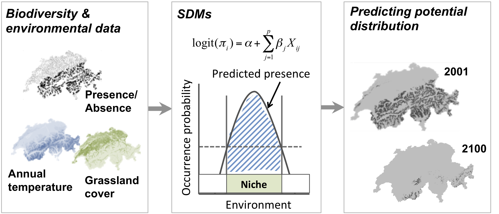
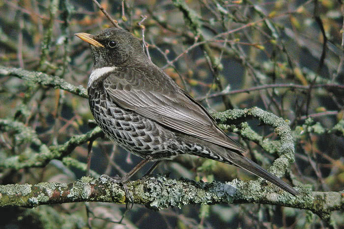

```{r setup, include=FALSE}
knitr::opts_chunk$set(echo = TRUE)
```

<div class="alert alert-info">
**RStudio project**

Open the RStudio project that we created in the first session. I recommend to use this RStudio project for the entire course and within the RStudio project create separate R scripts for each session. 

- Create a new empty R script by going to the tab "File", select "New File"  and then "R script"
- In the new R script, type `# Session b3: SDM introduction` and save the file in your folder "scripts" within your project folder, e.g. as "b3_SDM_intro.R"
</div>


# Introduction

This session will introduce you to simple species distribution models (SDMs). Species distribution models (SDMs) are a popular tool in quantitative ecology [@Franklin2010; @Peterson2011a; @Guisan2017] and constitute the most widely used modelling framework in global change impact assessments for projecting potential future range shifts of species [@IPBES2016]. There are several reasons that make them so popular: they are comparably easy to use because many software packages [e.g. @Thuiller2009; @phillips2006] and guidelines [e.g. @elith2008; @Elith2011; @Merow2013; @Guisan2017] are available, and they have comparably low data requirements. 

SDMs relate biodiversity observations (e.g. presence-only, presence/absence, abundance, species richness) at specific sites to the prevailing environmental conditions at those sites. Different statistical and machine-learning algorithms are available for this. Based on the estimated biodiversity-environment relationship,  we can make predictions in space and in time by projecting the model onto available environmental layers (Figure 1).

```{r sdmfig, echo=FALSE, fig.cap="**Figure 1. Schematic representation of the species distribution modelling concept. First, biodiversity and environmental information are sampled in geographic space. Second, a statistical model (here, generalised linear model) is used to estimate the species-environment relationship. Third, the species–environment relationship can be mapped onto geographic layers of environmental information to delineate the potential distribution of the species. Mapping to the sampling area and period is usually referred to as interpolation, while transferring to a different time period or geographic area is referred to as extrapolation.**", out.width = '70%'}

```

We distinguish five main modelling steps for SDMs: (i) conceptualisation, (ii) data preparation, (iii) model fitting, (iv) model assessment, and (v) prediction (Figure 2.). The last step (prediction) is not always part of SDM studies but depends on the model objective [@Zurell2020a]. Generally, we distinguish three main objectives for SDMs: (a) inference and explanation, (b) mapping and interpolation, and (c) forecast and transfer. I recommend getting more familiar with critical assumptions and modelling decisions by studying the many excellent review articles [@Guisan2000; @guisan2005; @Elith2009] and textbooks on SDMs [@Peterson2011a; @Franklin2010; @Guisan2017]. 

I would also like to emphasise that model building is an iterative process and there is much to learn on the way. In consequence, you may want to revisit and improve certain modelling steps, for example improve the spatial sampling design. Because of that I like to regard model building as a cycle rather than a workflow with a pre-defined termination point (Figure 2.)[@Zurell2020a].

```{r odmapfig, echo=FALSE, fig.cap="**Figure 2. The main modelling cycle in species distribution modelling.**", out.width = '50%'}
knitr::include_graphics("figures/sdm_steps.png")
```

## Prac overview
In this session, we will only work with Generalised Linear Models (GLMs) and concentrate on the first three model building steps (Figure 2.)

## Generalised linear models (GLMs)
Why do we not simply use linear regression to fit our species-environment relationship? Well, strictly, ordinary least squares (OLS) linear regression is only valid if the response (or rather the error) is normally distributed and ranges ($-\infty,\infty$). OLS regression looks like this

$$E(Y|X)=\beta X+\epsilon$$

where $E(Y|X)$ is the *conditional mean*, meaning the expected value of the response $Y$ given the environmental predictors $X$ [@Hosmer2013]. $X$ is the matrix of predictors (including the intercept), $\beta$ are the coefficients for the predictors, and $\epsilon$ is the (normally distributed!) error term. $\beta X$ is referred to as the linear predictor. 

When we want to predict species occurrence based on environment, then the conditional mean $E(Y|X)$ is binary and bounded between 0 (absence) and 1 (presence). Thus, the assumptions of OLS regression are not met. GLMs are more flexible regression models that allow the response variable to follow other distributions. Similar to OLS regression, we also fit a linear predictor $\beta X$ and then relate this linear predictor to the mean of the response variable using a link function. The link function is used to transform the response to normality. In case of a binary response, we typically use the logit link (or sometimes the probit link). The conditional mean is then given by:

$$E(Y|X) = \pi (X) = \frac{e^{\beta X+\epsilon}}{1+e^{\beta X+\epsilon}}$$

The logit transformation is defined as:
$$g(X) 	= ln \left( \frac{\pi (X)}{1-\pi (X)} \right)	= \beta X+\epsilon$$

The trick is that the logit, g(X), is now linear in its parameters, is continuous and may range ($-\infty,\infty$). GLMs with a logit link are also called logistic regression models. 

# Conceptualisation
In the conceptualisation phase, we formulate our main research objectives and decide on the model and study setup based on any previous knowledge on the species and study system. An important point here is whether we can use available data or have to gather own biodiversity (and environmental) data, which would require deciding on an appropriate sampling design. Then, we carefully check the main underlying assumptions of SDMs, for example whether the species is in pseudo-equilibrium with environment and whether the data could be biased in any way [cf. chapter 5 in @Guisan2017]. The choice of adequate environmental predictors, of modelling algorithms and of desired model complexity should be guided by the research objective and by hypotheses regarding the species-environment relationship. We can divide environmental variables into three types of predictors: resource variables, direct variables and indirect variables [@Austin1980; @Guisan2000]. 

## Example: Ring Ouzel
We aim at assessing potential climate change effects on the Ring Ouzel (*Turdus torquatus*) in UK  (Figure 3), a typical upland bird. First, we try to make ourselves familiar with Ring Ouzel ecology. For example, the RSPB in UK (The Royal Society for the Protection of Birds) as well as the IUCN (Internatinal Union for the Conservation of Nature) provide some species details on their websites ([RSPB](https://www.rspb.org.uk/birds-and-wildlife/wildlife-guides/bird-a-z/ring-ouzel/), [IUCN](https://www.iucnredlist.org/species/22708768/155629409)). Think about which factors could limit the distribution of Ring Ouzel in UK.

```{r birdfig, echo=FALSE, fig.cap="A male ring ouzel. Copyright Ruedi Aeschlimann. Downloaded from www.vogelwarte.ch.", out.width = '40%'}

```


# Data preparation
In this step, the actual biodiversity and environmental data are gathered and processed. This concerns all data that are required for model fitting but also data that are used for making transfers. In the previous sessions, you have already explored some ways to retrieve species data and environmental data. To simplify matters a little bit, I provide the processed data for this example, which you can download from [here](data/Prac3_data.zip) (or from the data folder in moodle). The data frame contains ring ouzel presences and absences as well as bioclimatic data.

The ring ouzel occurrence records were obtained from the British breeding and wintering birds citizen science atlas [@Gillings2019]. The atlas contains breeding bird records in 20-year cycles (1968-1972, 1988-1991, 2008-2011 and) wintering bird records in 30-year cycles (1981/1982-1983-1984, 2007/2008-2010/2011) at a 10 km spatial resolution throughout Britain, Ireland, the Isle of Man and the Channel Islands. The entire atlas data are available through the British Trust of Ornithology (www.bto.org) and can be downloaded [here](https://www.bto.org/sites/default/files/atlas_open_data_files.zip). I already extracted the confirmed breeding occurrences of the ring ouzel for the most recent atlas period 2008-2011. As absence data I used those locations where no ring ouzel occurrence was reported. Afterwards I spatially thinned the data such that all presence and absence locations are at least 20 km apart. This is important to avoid problems with spatial autocorrelation. The 19 bioclimatic variables were extracted from the worldclim data base (see detail on the variables [here](https://www.worldclim.org/data/bioclim.html)). 

Read in the data table:

```{r message=F}
library(raster)
bg <- raster('data/Prac3_UK_mask.grd')
sp_dat <- read.table('data/Prac3_RingOuzel.txt',header=T)
```

Inspect the data, and plot the presence and absence locations:
```{r}
summary(sp_dat)

# Plot GB land mass
plot(bg,col='grey',axes=F,legend=F)
# Plot presences in red and absences in black
plot(extend(rasterFromXYZ(sp_dat[,1:3]),bg), col=c('black','red'), legend=F,add=T)
```

# Model fitting

## Fitting our first GLM

Before we start into the complexities of the different model fitting steps,  let us look at a GLM in more detail. We fit our first GLM with only one predictor assuming a linear relationship between response and predictor. The `glm` function is contained in the R *stats* package. We need to specify a *formula* describing how the response should be related to the predictors, and the *data* specifying the data frame that contains the response and predictor variables, and a *family* argument specifying the type of response and the link function. In our case, we use the *logit* link in the *binomial* family.

```{r}
# We first fit a GLM for the bio11 variable assuming a linear relationship:
m1 <- glm(Turdus_torquatus ~ bio11, family="binomial", data= sp_dat)
	
# We can get a summary of the model:
summary(m1)	
```

### Deviance and AIC
Additional to the slope values, there are a few interesting metrics printed in the output called deviance and AIC. These metrics tell us something about how closely the model fits the observed data. 

Basically, we want to know whether a predictor is "important". We thus need to evaluate whether a model including this variable tells us more about the response than a model without that variable [@Hosmer2013]. Importantly, we do not look at the significance level of predictors. Such p-values merely tell us whether the slope coefficient is significantly different from zero. Rather, we assess whether the predicted values are closer to the observed values when the variable is included in the model versus when it is not included. 

In logistic regression, we compare the observed to predicted values using the log-likelihood function:

$$L( \beta ) = ln[l( \beta)] = \sum_{i=1}^{n} \left( y_i \times ln[\pi (x_i)] + (1-y_i) \times ln[1- \pi (x_i)] \right)$$

$L( \beta )$ is the *Likelihood of the fitted model*. From this, we can calculate the deviance $D$ defined as:

$$D = -2 \times L$$

In our model output, the deviance measure is called `Residual deviance`. This deviance is an important measure used for comparing models. For example, it serves for the calculation of *Information criteria* that are used for comparing models containing different numbers of parameters. One prominent measure is the *Akaike Information Criterion*, usually abbreviated as AIC. It is defined as:
$$AIC = -2 \times L + 2 \times (p+1) = D + 2 \times (p+1)$$

where $p$ is the number of regression coefficients in the model. AIC thus takes into account model complexity. In general, lower values of AIC are preferable. 

We can also use the deviance to calculate the *Explained deviance* $D^2$, which is the amount of variation explained by the model compared to the null expectation:
$$D^2 = 1 - \frac{D(model)}{D(Null.model)}$$
The model output also provides the `Null deviance`, so we can easily calculate the explained deviance $D^2$.

## More complex GLMs
We can also fit quadratic or higher polynomial terms (check `?poly`) and interactions between predictors:  
- the term `I()`indicates that a variable should be transformed before being used as predictor in the formula  
- `poly(x,n)` creates a polynomial of degree $n$: $x + x^2 + ... + x^n$  
- `x1:x2` creates a two-way interaction term between variables x1 and x2, the linear terms of x1 and x2 would have to be specified separately  
- `x1*x2` creates a two-way interaction term between variables x1 and x2 plus their linear terms  
- `x1*x2*x3` creates the linear terms of the three variables, all possible two-way interactions between these variables and the three-way interaction  

```{r echo=F}
# Fit a quadratic relationshop with bio1:
m1_q <- glm(Turdus_torquatus ~ bio11 + I(bio11^2), family="binomial", data= sp_dat)
```

Try out different formulas:
```{r eval=F}
# Fit a quadratic relationship with bio11:
m1_q <- glm(Turdus_torquatus ~ bio11 + I(bio11^2), family="binomial", data= sp_dat)
summary(m1_q)
	
# Or use the poly() function:
summary( glm(Turdus_torquatus ~ poly(bio11,2) , family="binomial", data= sp_dat) )

# Fit two linear variables:
summary( glm(Turdus_torquatus ~ bio11 + bio8, family="binomial", data= sp_dat) )

# Fit three linear variables:
summary( glm(Turdus_torquatus ~ bio11 + bio8 + bio17, family="binomial", data= sp_dat) )

# Fit three linear variables with up to three-way interactions
summary( glm(Turdus_torquatus ~ bio11 * bio8 * bio17, family="binomial", data= sp_dat) )

# Fit three linear variables with up to two-way interactions
summary( glm(Turdus_torquatus ~ bio11 + bio8 + bio17 + 
               bio11:bio8 + bio11:bio17 + bio8:bio17, 
             family="binomial", data= sp_dat) )
```

<div class="alert alert-info">
_**Exercise:**_

Compare the different models above. 

- Which model is the best in terms of AIC?
- What is the explained deviance of the different models?
- HINTS: you can extract the metrics using `AIC(m1)`, `deviance(m1)` and `m1$null.deviance`

</div>


## Important considerations during model fitting
Model fitting is at the heart of any SDM application. Important aspects to consider during the model fitting step are: 

- How to deal with multicollinearity in the environmental data? 
- How many variables should be included in the model (without overfitting) and how should we select these? 
- Which model settings should be used? 
- When multiple model algorithms or candidate models are fitted, how to select the final model or average the models? 
- Do we need to test or correct for non-independence in the data (spatial or temporal autocorrelation, nested data)? 
- Do we want to threshold the predictions, and which threshold should be used? 

More detailed descriptions on these aspects can be found in @Franklin2010 and in @Guisan2017.

## Collinearity and variable selection
GLMs (and many other statistical models) have problems to fit stable parameters if two or more predictor variables are highly correlated, resulting in so-called multicollinearity issues [@Dormann2013]. To avoid these problems here, we start by checking for multi-collinearity and by selecting an initical set of predictor variables. Then, we can fit our GLM including multiple predictors and with differently complex response shapes. This model can then be further simplified by removing "unimportant" predictors.

### Correlation among predictors
We first check for pairwise correlations among predictors. Generally, correlations below |r|<0.7 are considered unproblematic (or below |r|<0.5 as more conservative threshold).

```{r message=F}
library(corrplot)

# We first estimate a correlation matrix from the predictors. 
# We use Spearman rank correlation coefficient, as we do not know 
# whether all variables are normally distributed.
cor_mat <- cor(sp_dat[,-c(1:3)], method='spearman')

# We can visualise this correlation matrix. For better visibility, 
# we plot the correlation coefficients as percentages.
corrplot.mixed(cor_mat, tl.pos='lt', tl.cex=0.6, number.cex=0.5, addCoefasPercent=T)
```

Several predictor variables are highly correlated. One way to deal with this issue is to remove the "less important" variable from the highly correlated pairs. For this, we need to assess variable importance.

### Variable selection: removing highly correlated variables
If no prior knowledge is available on the importance of different predictors, then @Dormann2013 suggest to assess univariate variable importance in terms of AIC (Akaike information criterion) or explained deviance. In practice, this means that we fit a GLM separately for each predictor, assess the importance and then rank the variables according to their univariate importance. Earlier, we already fitted GLMs with linear and quadratic terms and compared AIC. Which one was better?

However, it's getting a bit more complicated when we want to compare all variables. First, we need to identify all pairs of variables that have correlation |r|>0.7 and remove the less important variable. @Dormann2013 call this the *select07* method.

A `select07()` function is implemented in the package `mecofun` along with some other useful functions for the entire *MGC* module. We first have to install the package from the Univ. Potsdam gitlab:


```{r eval=F}
library(devtools)
devtools::install_git("https://gitup.uni-potsdam.de/macroecology/mecofun.git")
```

Now, you can load the package and try out the function. Also, check out the help pages for `?select07`.

```{r}
library(mecofun)

# Run select07()
var_sel <- select07(X=sp_dat[,-c(1:3)], 
                    y=sp_dat$Turdus_torquatus, 
                    threshold=0.7)

# Check out the structure of the resulting object:
str(var_sel)

# We extract the names of the weakly correlated predictors ordered by the univariate variable importance in terms of AIC:
pred_sel <- var_sel$pred_sel
```

So, we have now reduced our set of 19 bioclimatic variables to 8 predictors that are only weakly correlated. Now, we need to decide whether all of these should be included in the final model, or if we select only a few, for example the two most important variables in terms of univariate AIC. As a rule of thumb, we should have ten presence points per parameter fitted in the model [@Guisan2017]. 

```{r}
# How many presence points do we have?
sum(sp_dat$Turdus_torquatus)
```

According to the rule of thumb, we can only include 4 parameters and want to include quadratic terms as well. Thus, for this example, we should only use two predictors. In our case, the best two predictors in terms of univariate AIC were bio11 and bio8.

## Model selection 
Now that we have selected a set of weakly correlated variables, we can fit the full model and then simplify it. The latter is typically called model selection. Here, I only use the two most important variables and include linear and quadratic terms in the full model. 

```{r}
# Fit the full model:
m_full <- glm( Turdus_torquatus ~ bio11 + I(bio11^2) + bio8 + I(bio8^2), 
               family='binomial', data=sp_dat)

# Inspect the model:
summary(m_full)
```

How much deviance is explained by our model? The function `expl_deviance()` is also contained in the `mecofun` package. As explained earlier, we can calculate explained deviance by quantifying how closely the model predictions fit the data in relation to the null model predictions.
```{r message=F, warning=F}
# Explained deviance:
expl_deviance(obs = sp_dat$Turdus_torquatus,
              pred = m_full$fitted)
```

We can simplify the model further by using stepwise variable selection. The function `step()` uses the AIC to compare different subsets of the model. Specifically, it will iteratively drop variables and add variables until the AIC cannot be improved further (meaning it will not decrease further).

```{r echo=F, results='hide'}
m_step <- step(m_full)
```

```{r eval=F}
m_step <- step(m_full) 
```

```{r}
# Inspect the model:
summary(m_step)

# Explained deviance:
expl_deviance(obs = sp_dat$Turdus_torquatus,
              pred = m_step$fitted)
```

The final model only selected the linear terms for bio11 and bio8. The explained deviance is a tiny bit lower than for the quadratic model, but the linear model is more parsimonious. 

<div class="alert alert-info">
_**Exercise:**_

Fit the full model containing all weakly correlated variables.

- Look up the eight weakly correlated variables in the object `pred_sel`.
- Define a full model with these eight variables including their linear and quadratic terms.
- Run the full model.
- Simplify the model using stepwise variable selection `step()`
- Compare the full model and the reduced model in terms of AIC and explained deviance.
</div>


# References